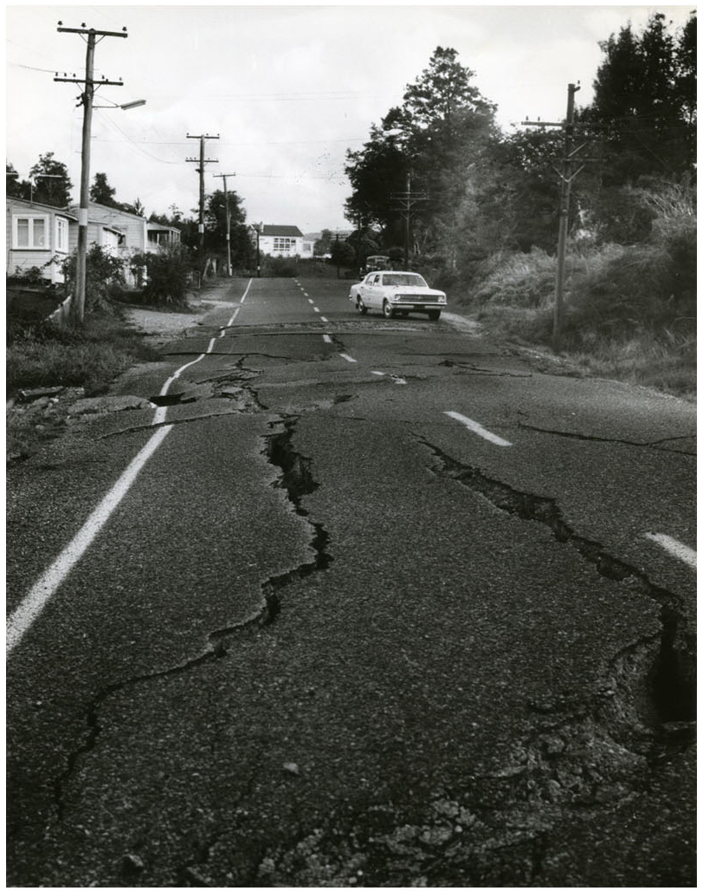

--- 
title: "Night Tremors: There are more earthquakes at night"
author: "David Hood"
date: "2017-05-02"
site: bookdown::bookdown_site
documentclass: book
description: "The sun's daily cycle + gravity = earthquakes"
---
# Front Matter {-}



There are times — possibly never, for most people — that you encounter a result so unlikely, so against common wisdom, that you need to write several thousand words and run many statistical tests to explain the result. This monograph is caused by such events.

## Intended Audiences

Carl Sagan popularised the phrase “extraordinary claims require extraordinary evidence”, and in working through my analysis and discussing it with people, I have certainly been aware of a healthy scepticism about the results. One way of providing evidence is to make the analysis completely reproducible. I conducted the analysis in the data analysis language R, and anyone generally competent in the language should be able to repeat my analysis and verify my conclusions. By using R, I can provide a start to finish trail of everything I did in conducting the analysis, with accompanying text as to why. So, one audience is people who go “What !?!” at the title, and want to look for mistakes.

In my experience of helping many people learn data analysis skills over the years, there is a common pattern. After acquiring some skills, people can stall because they are not sure of how to apply them. This gives my narrative of conducting the analysis, including what I  noticed, why I chose particular techniques, and how I interpreted the results. For those people with some data analysis skills, this will hopefully give some ideas about how to use them and why.

I am making some strong, evidence-based, claims through the book about the sun and earthquakes, so the book might be of interest to those with a general interest in geophysics. My methods in analysing this data are general statistical techniques, rather than geophysics modelling. As a consequence, what I am identifying about earthquakes is different to a structural geological approach. The difference in ways of looking at the data means, at the time of writing, there is still work to be done unifying these conclusions with traditional geological understanding.

Finally, this is a case study in citizen science. I am not a geologist. However, the techniques applied are within the grasp of anyone prepared to put in the time to study books and online resources, and the data used is publicly available. The hard labour was done by the seismologists establishing the earthquake monitoring networks around the world and gathering the data. I am just benefitting from that data (and the knowledge of how to analyse the data) being publicly available. This kind of analysis is an example of something within reach of anyone taking an interest in improving their statistical skills. For me, I worked with data for many years, and over a year or so brushed up my statistical skills in evenings and weekends. I then did this analysis on a home computer in evenings and weekends. The resources for people to do this are out there; it is a matter of time and practice.

## Acknowledgements

I would like to thank Simon Cox, Principal Scientist,  GNS Science - Te Pu Ao, for asking challenging and well thought-out questions that led me to extend my analysis from “this is freaky” to “this is what is going on”.

I would not have had the skills to do this analysis if I hadn’t done a lot of online courses in analysing data in the past few years. I would particular like to note Mine Çetinkaya-Rundel, Roger Peng, Jeff Leek, and Brian Caffo for offering material that helped me up-skill my statistical and analysis understanding.

## Cover Picture

The cover picture is of the 1968 Inangahua earthquake, that occurred at 5:24 am (local time) when the sun was 26 degrees below the horizon. The image comes from Archives New Zealand and is reproduced under a Creative Common Attribution 2.0 Generic license [Link 1](#Links0)

## Edition

This is the 0.9th edition, of 2nd May 2017. In need to fix the code line lengths so everything fits on the page in the PDF version, but I thought I would make everything available while I did that. The website version should not change, and the new PDF should be up in the next week. Until then you can see all the code in the web version.

book site: https://thoughtfulbloke.github.io/eqnz/

github repo: https://github.com/thoughtfulbloke/eqnz

## Statistics

While in the earlier drafts I used some complex statistical techniques that need a number of settings, I have trimmed it back to simple techniques that are sufficient to make the point (and deliver similar results to the more complex techniques).

One concept I make heavy use of is coin-toss (binomial) style statistical results. The idea that an earthquake could occur with one of two outcomes i.e. day or night; later in the analysis, there are binary choices like when the sun is 30 to 40 degrees below the horizon or the sun is at another angle. The statistics boil down to how likely the possible outcomes are given the chance of each option and the number of times I toss a coin (or have an earthquake occur in the data).

I also use confidence intervals in this study. These are ranges of outcomes that there is a probability of the "true" value being inside the range. In most of the study, I am using up to seven sigma intervals. Two sigma is considered worth publishing, and five sigma is used for confidence about fundamental physics experiments. With seven sigma, the true value is expected to be within the range 99.999999999744% of the time.


## Using R

I include all the code for repeating the analysis in the course of the book. However, this book is not a full tutorial in learning R for data analysis. As there are many resources for learning R, I am writing this under the assumption that people who want to understand the detail of the code are familiar enough with R to understand data types, the dplyr analysis workflow, and the use of functions.

When I started the analysis I was using R version 3.2, by the time I finished this book I was using R version 3.3.2. Everything still works in the same way, so my only advice is to use a recent enough version that you can use all the same packages (helper libraries) I used in the analysis. To specifically cite the work of others in the creation of R and supporting packages (in order of package name):

R Core Team (2016). R: A language and environment for statistical computing. R Foundation
  for Statistical Computing, Vienna, Austria. URL https://www.R-project.org/.
  
binom for making confidence intervals

Sundar Dorai-Raj (2014). binom: Binomial Confidence Intervals For Several
  Parameterizations. R package version 1.1-1. https://CRAN.R-project.org/package=binom

bookdown for making the book

Yihui Xie (2016). bookdown: Authoring Books and Technical Documents with R Markdown. R package version
  0.3.

dplyr for general purpose data manipulations

Hadley Wickham and Romain Francois (2016). dplyr: A Grammar of Data Manipulation. R
  package version 0.5.0. https://CRAN.R-project.org/package=dplyr

geosphere for calculating distances

Robert J. Hijmans (2016). geosphere: Spherical Trigonometry. R package version 1.5-5.
  https://CRAN.R-project.org/package=geosphere

ggplot for some of the graphs

H. Wickham. ggplot2: Elegant Graphics for Data Analysis. Springer-Verlag New York, 2009.

lubridate for date operations

Garrett Grolemund, Hadley Wickham (2011). Dates and Times Made Easy with lubridate.
  Journal of Statistical Software, 40(3), 1-25. URL http://www.jstatsoft.org/v40/i03/.
  
mapdata for a detailed map of New Zealand

Original S code by Richard A. Becker and Allan R. Wilks. R version by Ray Brownrigg.
  (2016). mapdata: Extra Map Databases. R package version 2.2-6.
  https://CRAN.R-project.org/package=mapdata

maps for drawing maps

Original S code by Richard A. Becker, Allan R. Wilks. R version by Ray Brownrigg.
  Enhancements by Thomas P Minka and Alex Deckmyn. (2016). maps: Draw Geographical Maps. R
  package version 3.1.1. https://CRAN.R-project.org/package=maps

maptools for the position of the sun

Roger Bivand and Nicholas Lewin-Koh (2016). maptools: Tools for Reading and Handling
  Spatial Objects. R package version 0.8-39. https://CRAN.R-project.org/package=maptools

plotrix for round graphs

Lemon, J. (2006) Plotrix: a package in the red light district of R. R-News, 6(4): 8-12.

readr for reading in some data

Hadley Wickham, Jim Hester and Romain Francois (2016). readr: Read Tabular Data. R
  package version 1.0.0. https://CRAN.R-project.org/package=readr
  
rvest for getting data from the web

Hadley Wickham (2016). rvest: Easily Harvest (Scrape) Web Pages. R package version 0.3.2.
  https://CRAN.R-project.org/package=rvest

tidyr for data rearrangement

Hadley Wickham (2016). tidyr: Easily Tidy Data with `spread()` and `gather()` Functions.
  R package version 0.6.0. https://CRAN.R-project.org/package=tidyr

## Contacting me

Should you want to reach me, possible ways are Twitter [Link 2](#Links0), my blog [Link 3](#Links0), Github [Link 4](#Links0), or even email [Link 5](#Links0).


## Links {#Links0}

For each section in the monograph, relevant links for the section are listed near the end so that it works in print as well as on a webpage. For example:

1 - Cover Image: https://www.flickr.com/photos/archivesnz/8808854738

2 - On Twitter: https://twitter.com/Thoughtfulnz

3 - My Blog: https://thoughtfulbloke.wordpress.com

4 - On Github: https://github.com/thoughtfulbloke/

5 - e-mail: david@thoughtful.net.nz


## Chapter Code

At the end of each section is any R code used in the creation of that section. In the case of library() commands, these libraries need to be pre-installed on the computer. This code includes a lot of commands found in other chapters as I have tried to make each section self contained so people can run just the parts that interest them. My own version of the code shares code between chapters, so is organised a little differently.

For most of chapters that draw on the New Zealand data, you will need to run Chapters 1 and 2 to prepare the data before running the other chapters.


```r
library(lubridate)
library(maptools)
# Angles of the sun for the Inangahua earthquake
# As NZ Standard Time in May 1968, I am just subtracting 12 hours to make UTC
dt <- ymd_hm("1968-05-28 05:24", tz = "UTC") - hours(12)
solarpos(matrix(c(172.04, -41.76), nrow=1), dt)
```

As I technical note to Rmarkdown users, I purled the code in each chapter to create a separate file which I embeded at the end of the chapter.

I used a MIT licence for the code on Github, which I understand means people are free to use any of the code but should acknowledge me if you copy it directly.
